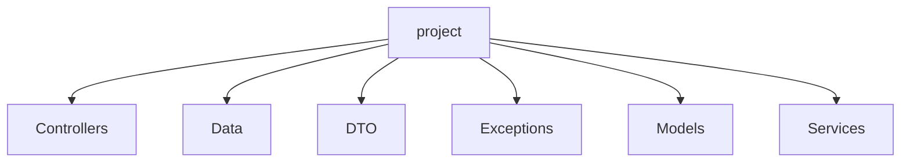

# Sprint 03 | .Net 

## Integrantes
| Nome                   |   RM   |
|:-----------------------| :----: |
| Otavio Miklos Nogueira | 554513 |
| Luciayla Yumi Kawakami | 557987 |
| João Pedro Amorim Brito | 559213 |

## Arquitetura

O projeto conta com as melhores práticas do mercado sendo separado por camadas que facilitam seu uso e entendimento, como Controller, Service, Models, Exceptions e Data. Cada uma dessas camadas tem uma função e motivo.



Todos os endpoints do projeto estão mapeados e documentados com a ajuda do Swashbuckle. 

## Rodando o projeto

### Inicialização
```bash
# Clone o projeto
git clone https://github.com/omininola/sprint3_dotnet

# Entre no diretório do projeto
cd sprint3_dotnet
```

### Conexão com o Oracle
`appsettings.json`
```json
{
  "Logging": {
    "LogLevel": {
      "Default": "Information",
      "Microsoft.AspNetCore": "Warning"
    }
  },
  "AllowedHosts": "*",

  "ConnectionStrings": {
    "DefaultConnection": "Data Source=oracle.fiap.com.br:1521/orcl;User ID=<SEU_RM>;Password=<SUA_SENHA>"
  }
}
```

### Rodando & Testes
```bash
# Dentro do diretório rode o projeto com o comando abaixo
dotnet run
```

1. No seu navegador de preferência entre na url:
[http://localhost:8080/swagger](http://localhost:8080/swagger)
2. Rode as requisições HTTP
